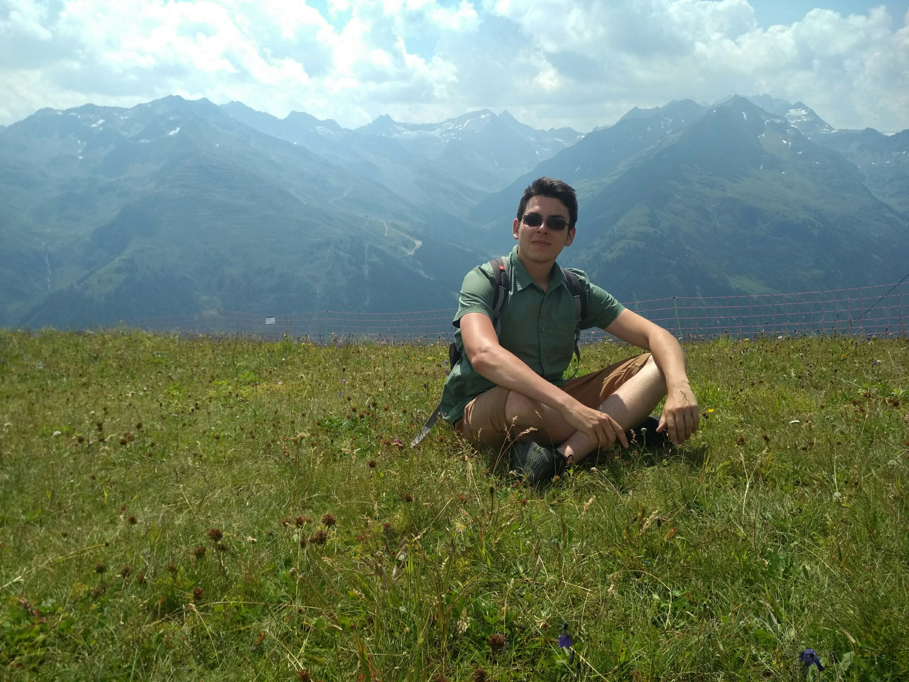

 

Я увлёкся разработкой программного обеспечения осенью 2016 на первом курсе направления "Прикладная математика и информатика" Инженерной Академии РУДН. Университетский курс дал мне хорошую алгоритмическую базу и базовые навыки системного программирования на C/C++.

Моя карьера в IT началась в январе 2017 в Группе Компании [Да-стратегия](https://da-strateg.ru), где я работал с MERN стеком.

Я так же интересовался сферой искусственного интеллекта. Освоил необходимые инструменты для сбора, анализа и визуализации данных на Python. Изучал как классические модели машинного обучения, так и глубокое обучение.

В мае 2018 я присоединился к команде разработчиков [Time2Chain](https://t2ch.github.io/), где занимался проектированием оверлейной пиринговой сети для открытой блокчейн-платформы, писал сопутствующие сервисы (обозреватель блоков, консольные и веб-интерфейсы). Работа над этим проектом дала мне бесценный опыт разработки децентрализованных приложений.

В феврале 2019 открыл свою IT-аутсорсинговую компанию.

На данный момент совмещаю основную деятельность с должностью консультирующего технического директора в компании OOO "Астана" и написанием диплома бакалавра.
 
В свободное от учёбы и работы время люблю читать и лазать по скалам.

