Do you want to create blazing fast sites, using your favorite web framework, with support for the latest
SEO, PWA and interface availability recommendations without writing a single line of server code? You are welcome!

## JAMstack

> JAM = JavaScript + APIs + Markup

Despite the name, this is not a set of tools, but a general approach to application design, which consists of three components:

- JavaScript – Programming language we need to develop browser-based interactive. For very simple sites, you can do without it

- APIs – Data sources from which static pages will be generated. Anything can serve as a source: databases, CMS or git repository

- Markup – Literally, this is the markup of the site. At the primitive level, these are interconnected html files.
  But often the use of static site generator (SSG), which create pages from received data according to a predetermined pattern

## Architecture

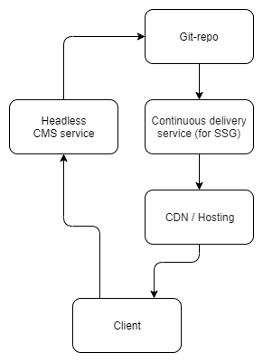

Cloud services are used as a backend. All development comes down to designing templates for SSG, which hosted in git repository with data. 
The repository connects to [continuous delivery service (CD)](https://aws.amazon.com/devops/continuous-delivery/), 
which tracks changes in source code, runs the generator and places the resulting pages in 
[content delivery network (CDN)](https://en.wikipedia.org/wiki/Content_delivery_network). Developers update the site 
by sending commits to the repository directly, and non-technical specialists use a cloud-based CMS, also connected to the repository.

## Benefits of JAMstack

### High load speed and fault tolerance

Since all pages are created in advance, the server does not waste time requesting and parsing data, 
which allows you to process more requests per second.

### Security

The logic of interaction is reduced to transferring the created file by get-request. 
Simpler the system, the less potential vulnerabilities in it.

### Scalability and low support costs

Through the use of CDN, a stable fast response time and high uptime are ensured. Easy integration of the git repository 
with [continuous integration and delivery services (CI/CD)](https://en.wikipedia.org/wiki/CI/CD) allows you to effectively 
automate the process of developing, testing, deploying and scaling of application.

## Limitations of JAMstack

### Slow Content Updates

Any change of data in repository causes a redeployment of project to CD, which may last a few minutes.

### Loading dynamic data

If you need pages that must provide dynamic or time sensitive data, then we will have to request and cache 
them on the client side after loading the page. This is not a perfect solution.

> It is better to use traditional approaches with server rendering, when you have a large amount of dynamic content.

## Usage

Based on all the pros and cons, JAMstack is great for developing personal pages, portfolios, blogs, documentation and
any other static sites where the speed of updating content is fading into the background.

## Blog development example Using Gatsby, Netlify, NetlifyCMS, and GitHub

> This guide assumes that you are already familiar with [NodeJS](https://nodejs.org/en/) software platform,
> [git](https://git-scm.com/) console client, [React](https://reactjs.org/) library 
> and have [GitHub](https://github.com/) account.

There are a huge number of tools for creating JAM applications. The following stack will be used in this example:

- [Gatsby](https://www.gatsbyjs.org/) – Open source generator of static sites from React + GraphQL applications. 
On the one hand, it has a convenient plugin system, which allows you to develop sites with minimal time, 
on the other hand have very flexible configuration.

- [NetlifyCMS](https://www.netlifycms.org/) – Open source content management system that separates 
the data layer from the display layer (headless CMS). It has convenient integration with git repositories.

- [Netlify](https://www.netlify.com/) – Shareware cloud platform providing tools for continuous deployment and its own CDN.

GitHub will be used to store content and source code.

### Creating blog using Gatsby

Install gatsby using node package manager:

```
npm i -g gatsby-cli
```

Create a new project:

```
gatsby new gatsby-blog-example
```

Change directories into site folder:

```
cd gatsby-blog-example
```

Project structure:

```
/
|-- /src
    |-- /pages
    |-- /images
    |-- /components
|-- gatsby-config.js
|-- gatsby-node.js
|-- gatsby-ssr.js
|-- gatsby-browser.js
```

Some notable files and their definitions:

- `gatsby-config.js` — configure options for a Gatsby site, with metadata for project title, description, plugins, etc.

- `gatsby-node.js` — implement Gatsby’s Node.js APIs to customize and extend default settings affecting the build process

- `gatsby-browser.js` — customize and extend default settings affecting the browser, using Gatsby’s browser APIs

- `gatsby-ssr.js` — use Gatsby’s server-side rendering APIs to customize default settings affecting server-side rendering

By default, Gatsby creates pages in `src/pages` folder.

Run local development server:

```
gatsby develop
```

You can browse the site at http://localhost:8000/.

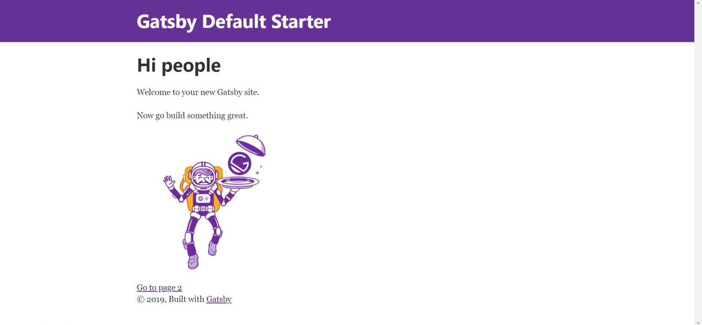

You also have a browser for GraphQL (http://localhost:8000/___graphql), where you can view the data 
and query patterns that are used when rendering pages.

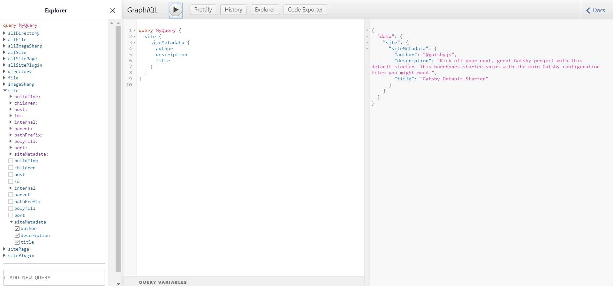

We will store blog posts in markdown markup. Let's create a separate folder for blog posts:

```
mkdir content
```

And add the file `first_post.md` with the following content:

```md
---
path: '/blog/my-first-post'
date: '2019-12-09'
title: 'My first blog post'
---

# Hello world!

this is my first blog post in markdown.

```

We declare a set of variables at the beginning of `first_post.md` using [yaml](https://ru.wikipedia.org/wiki/YAML) syntax, called 
frontmatter.

In order for Gatsby to automatically create pages from markdown files and recognize data from frontmatter, 
we need to use two plugins:

- [gatsby-source-filesystem](https://www.gatsbyjs.org/packages/gatsby-source-filesystem/) — imports data into the application from 
local file system

- [gatsby-transformer-remark](https://www.gatsbyjs.org/packages/gatsby-transformer-remark/) — Transform markdown to React components

gatsby-source-filesystem is already included in the starter template, so we only need to install the second plugin:

```
npm i gatsby-transformer-remark
```

Connect plugins in `gatsby-config.js`:

```js
plugins: [
    {
        resolve: `gatsby-source-filesystem`,
         options: {
            name: `blog`,
            path: `${__dirname}/content`,
        },
    },
    `gatsby-transformer-remark`,
    ...
]

```

Restart our development server. Going to the graphQL browser, we will see that new data has become available to us. 
We will send test request and get valid response.

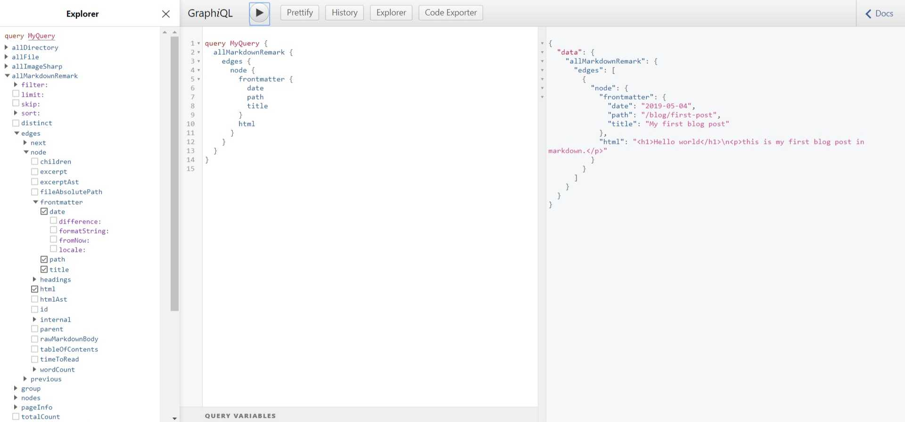

We managed to add a new data source for our generator! It remains only to display 
content on the site.

First of all, create a blog page template in file `src/templates/blogPost.js`:

```jsx
import React from 'react'
import { graphql } from 'gatsby'

import Layout from '../components/layout'

export default function Template({
  data, // this prop will be injected by the GraphQL query below.
}) {
  const { markdownRemark } = data // data.markdownRemark holds your post data
  const { frontmatter, html } = markdownRemark
  return (
    <Layout>
      <h1>{frontmatter.title}</h1>
      <h2>{frontmatter.date}</h2>
      <div dangerouslySetInnerHTML={{ __html: html }} />
    </Layout>
  )
}

export const pageQuery = graphql`
  query($path: String!) {
    markdownRemark(frontmatter: { path: { eq: $path } }) {
      html
      frontmatter {
        date(formatString: "MMMM DD, YYYY")
        path
        title
      }
    }
  }
`
```

Now we program in `gatsby-node.js`, how posts will be rendered. 
To do this, we use the `createPages` API described in the specification [Gatsby Node APIs](https://www.gatsbyjs.org/docs/node-apis/):

```js
const path = require(`path`)

exports.createPages = async ({ actions, graphql, reporter }) => {
  const { createPage } = actions
  const blogPostTemplate = path.resolve(`src/templates/blogTemplate.js`)
  const result = await graphql(`
    {
      allMarkdownRemark(
        sort: { order: DESC, fields: [frontmatter___date] }
        limit: 1000
      ) {
        edges {
          node {
            frontmatter {
              path
            }
          }
        }
      }
    }
  `)

  // Catch errors
  if (result.errors) {
    reporter.panicOnBuild(`Error while running GraphQL query.`)
    return
  }

  result.data.allMarkdownRemark.edges.forEach(({ node }) => {
    createPage({
      path: node.frontmatter.path,
      component: blogPostTemplate,
    })
  })
}
```

Our post will be available at http://localhost:8000/blog/first-post/ 

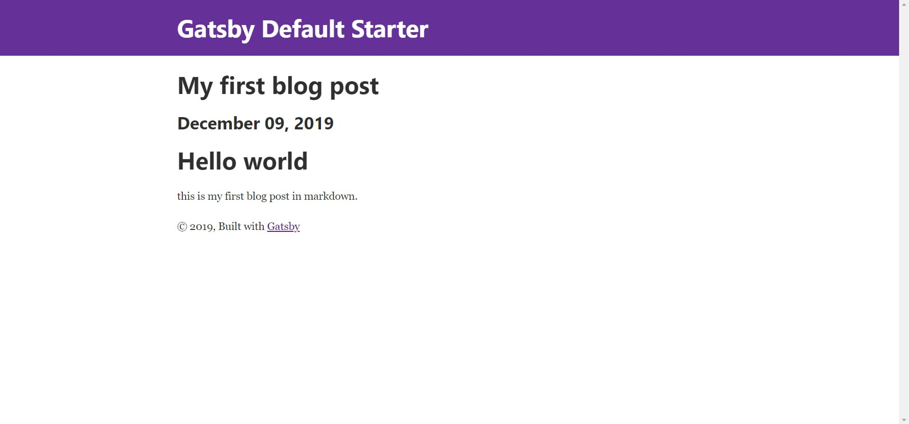

It's time to write a second post! Create file `content/second-post.md`:

```md
---
path: '/blog/second-post'
date: '2019-12-09'
title: 'My second blog post'
---

this is my second amazing post.
```

Finally, add a list of all the posts to the main page by editing `src/pages/index.js`:

```jsx
import React from 'react'
import { Link, graphql } from 'gatsby'

import Layout from '../components/layout'
import SEO from '../components/seo'

const IndexPage = ({ data }) => {
  const posts = data.allMarkdownRemark.edges

  return (
    <Layout>
      <SEO title="Home" />
      <h1>Hi people</h1>
      <p>Welcome to your new Gatsby site.</p>
      <p>Now go build something great.</p>
      <h2>Blog Posts</h2>
      <ul>
        {posts.map(({ node: post }) => (
          <li key={`${post.frontmatter.title}`}>
            <Link to={post.frontmatter.path}>{post.frontmatter.title}</Link>
            <br />
            <small>{post.frontmatter.date}</small>
          </li>
        ))}
      </ul>
      <hr />
      <Link to="/page-2/">Go to page 2</Link>
    </Layout>
  )
}

export default IndexPage

export const pageQuery = graphql`
  query MyQuery {
    allMarkdownRemark {
      edges {
        node {
          frontmatter {
            date
            path
            title
          }
        }
      }
    }
  }
`
```

We get the following result after restarting of the development server:

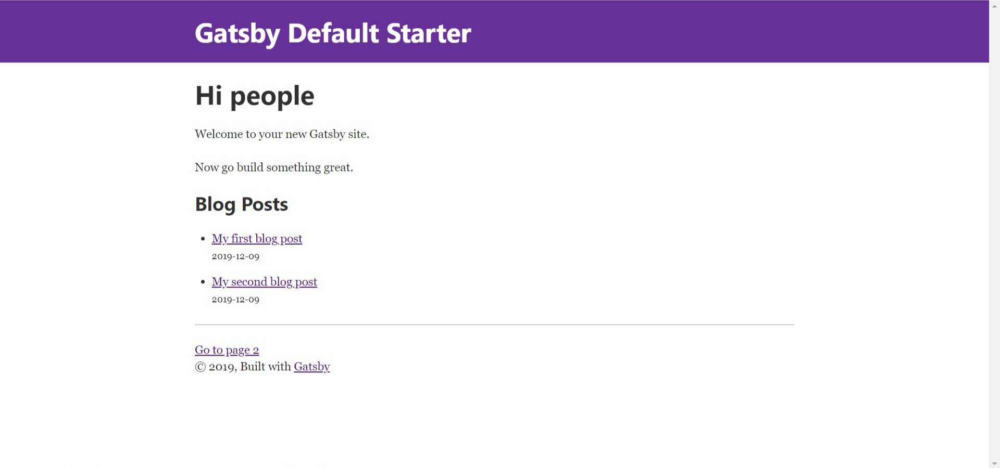

Delete app tempory files:

```
gatsby clean
```

And build production version:

```
gatsby build
```

Site data saved in `public` folder.

Our blog is ready to be published online!

### Publish project using GitHub and Netlify

Create new repository on [GitHub](https://github.com/) named `gatsby-blog-example` and upload our source code:

```
git add .
git commit -m "init"
git remote add origin https://github.com/[You account]/gatsby-blog-example.git
git push -u origin master

```

Go to [Netlify](https://www.netlify.com/) and sign up, using Github account.
You will be redirected to the main dashboard after successful registration.

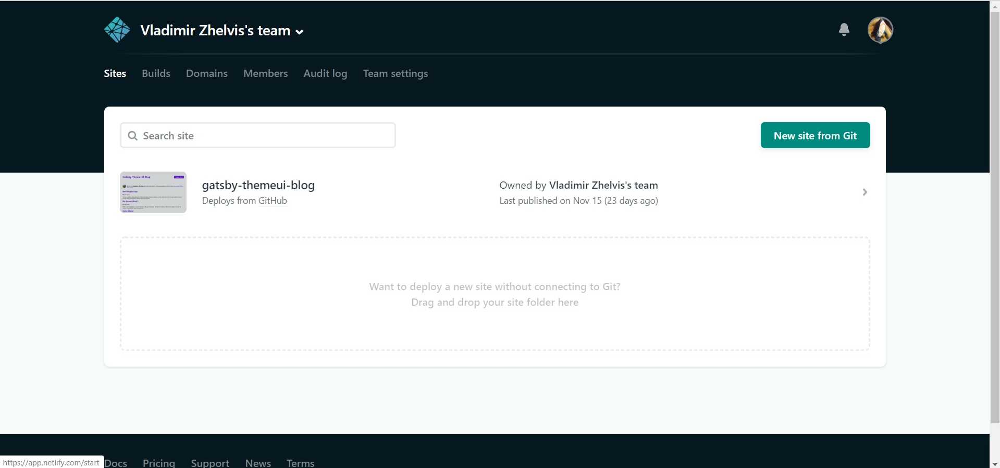

Creating a new site is divided into three simple steps:

First step is selection the necessary git provider. This is GitHub in our example.

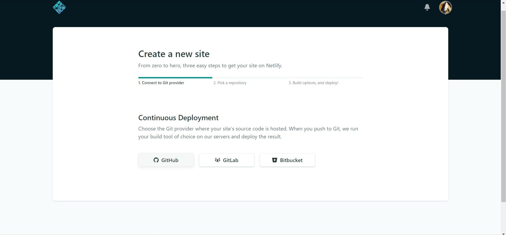

Then we connect repository.

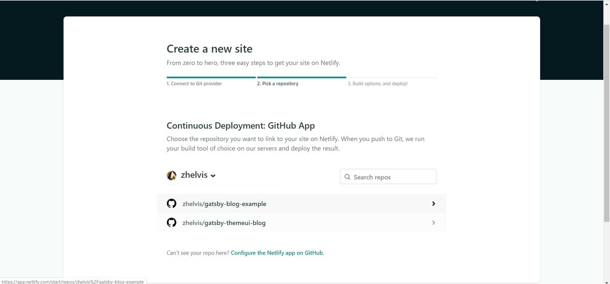

The last step is to set the build options. Netlify by default tracks changes in the master branch of the repository.
Specify build command, and select the `public` folder as the path to the statics.

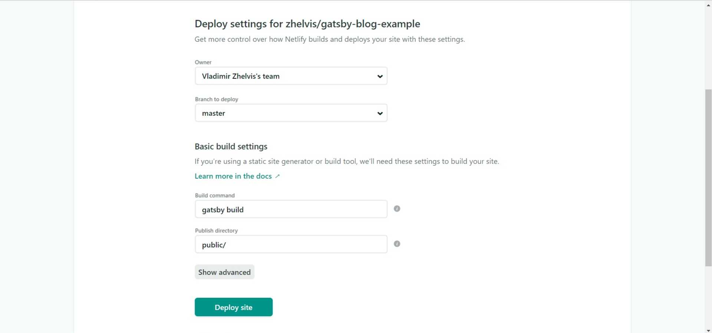

During building, Netlify downloads the source code from Github, launches Gatsby, and deploy project in its own 
CDN with adding random domain and SSL certificate. In the settings you can change the domain to your own, as well 
as familiarize yourself with real-time CD process logs.

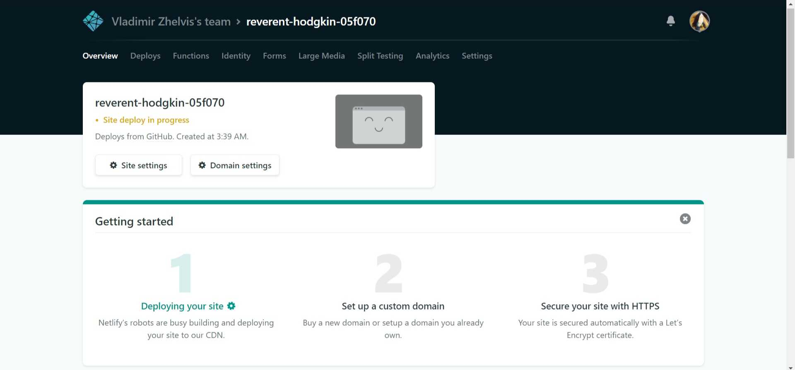

After a short time, your blog will be available for all internet users.
This example is located at https://reverent-hodgkin-05f070.netlify.com/.

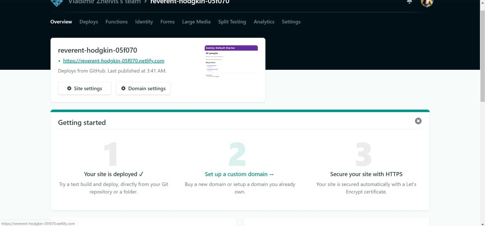

When you send commit to master branch, Netlify automatically redeploy the site.

### Connect NetlifyCMS

At this stage, we can edit, add and delete posts by sending commits to GitHub. 
But it’s much more convenient to use a Content Management System for this.

Add a couple of new dependencies to the project:

- [netlify-cms-app](https://www.npmjs.com/package/netlify-cms-app) – Content dashboard for static sites, which is 
client-side React Single Page Application.

- [gatsby-plugin-netlify-cms](https://www.gatsbyjs.org/packages/gatsby-plugin-netlify-cms/?=gatsby-pligin-net) – Gatsby plugin, 
that adds `netlify-cms-app` to the SSG build.

```
npm i netlify-cms-app gatsby-plugin-netlify-cms

```

And connect plugin in `gatsby-config.js`:

```js
plugins: [
    ...
    `gatsby-plugin-netlify-cms`
]
```

Create file `config.yml` in folder `static/admin` with the following content:

```yml
backend:
  name: git-gateway
  branch: master

media_folder: static/img
public_folder: /img

collections:
  - name: 'blog'
    label: 'Blog'
    folder: 'content'
    create: true
    editor:
      preview: false
    fields:
      - { label: 'Path', name: 'path', widget: 'string' }
      - { label: 'Title', name: 'title', widget: 'string' }
      - { label: 'Publish Date', name: 'date', widget: 'string' }
      - { label: 'Body', name: 'body', widget: 'markdown' }
```

Upload out changes to GitHub:

```
git add .
git commit -m "add NetlifyCMS"
git push
```

Set up authorization for admin panel:

Open Netlify dashboard and go to Site Settings > Identity. Enable Identity service.

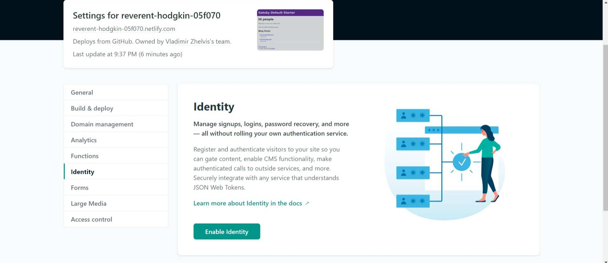

The registration in CMS opened by default. We will configure it so that the authors register by invitation.

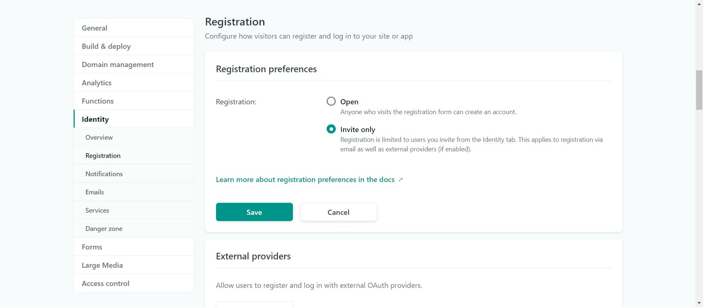

Go to Identity tab on main dashboard and invite new member.

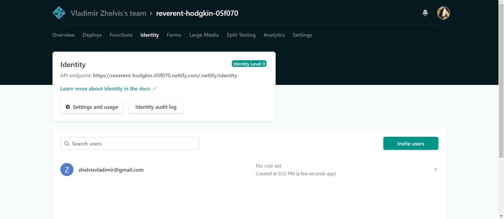

Invitation will come to the email. By clicking on the link, register and get access to the CMS panel.

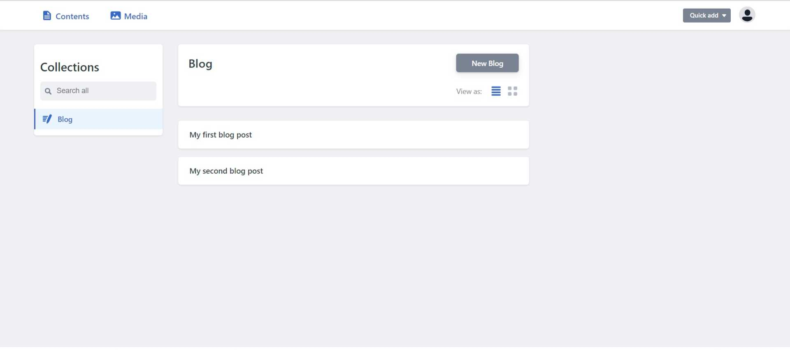

CMS available by `/admin` URL. Now we have the opportunity to interact with content through a browser.

### Links

[Source code of this example](https://github.com/zhelvis/gatsby-blog-example)

[Example site published on Netlify](https://reverent-hodgkin-05f070.netlify.com/)
